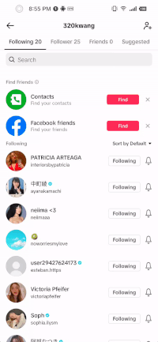

# TikTok-Unfollow-Bot-Android
Unfollowing on TikTok with Python Script

# Demo

# Features

- The code is concise, operates purely locally, and protects your privacy.
- Uses the official Android Debug Bridge (ADB) to accurately identify the location of the "Unfollow" button on the page and perform the operation.
- Compatible with situations where the layout cannot be obtained when there are "live broadcast avatars" in the follow-up list.

# Requirements

- Operating System Support: Windows/Mac/Linux
- Phone Requirements: Android
- TikTok Android versions that passed the test: 30.4.x
- [ADB](https://developer.android.com/studio/releases/platform-tools) needs to be installed and placed in the environment directory.
- Python3 needs to be installed and placed in the environment directory (Mac is pre-installed, Windows needs to be installed [manually](https://www.python.org/downloads/)).

# Pages that support unfollowing

- The page of people you are following

# Precautions

- The script will automatically stop after unfollowing all the people with the least recent interaction or on the following page.
- The script will not unfollow people who are "mutual followers" on the following page.

# How to run

- Open the TikTok App.
- Enter the page of people you are following.
- Connect your Android phone to your computer via USB.
- Enable "Developer Options" on your Android phone: usually located in Settings > About Phone > Software Information > Version Number. Tap the version number seven times in a row, and it will prompt you that you have successfully enabled developer options. [see more](https://developer.android.com/studio/debug/dev-options#enable)
- On your Android phone, open "Advanced Settings" > "Developer Options" > "USB Debugging." [see more](https://developer.android.com/studio/debug/dev-options#Enable-debugging)
- On the pop-up window on your phone, confirm that you want to enable debugging and trust the current computer.
- On Mac, open "Terminal"; or on Windows, open "Command Prompt": Windows key + R > type "cmd" > press Enter.
- Navigate to the root directory of the project: in the "Terminal" or "Command Prompt" window, type "cd + space," then drag the project directory into the window with the mouse, and press Enter.
- In the "Terminal" or "Command Prompt" window, type "python3 unfollow.py" and press Enter.

# By me a coffee

